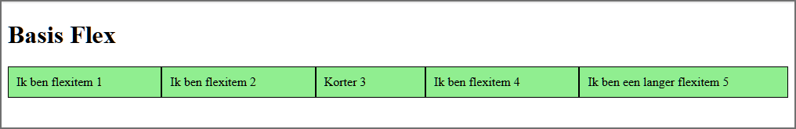
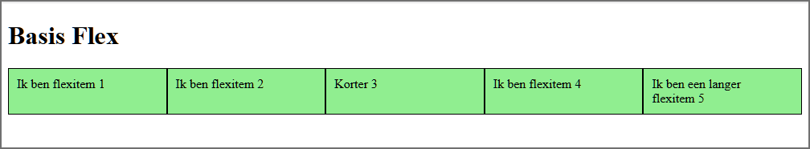
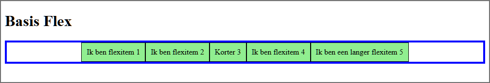

# Les 10 - Starter oefeningen H10 - Flex Layout

Download of clone deze repository. 

De Developer Tools van de browser Mozilla Firefox zijn handiger om te werken met Grid Layout en Flex Layout dan de Developer Tools van Google Chrome. Gebruik dus voor deze oefeningen Mozilla Firefox in plaats van Google Chrome.

## Oefening 1: Basis Flex Layout 

- Open de map **basis_flex_layout** in Visual Studio Code.

- **opdracht1.html**
  - Maak van het element met `class="flex-container"` een 'flex container' (block-level). Merk op dat de 'flex items' de breedte van hun 'content' innemen.<br>
  - Standaard groeien 'flex items' niet, maar krimpen ze wel. Controleer dit door met jouw muis je browservenster smaller en breder te maken.
  - Verander de richting zodat je het volgende bekomt:

    

- **opdracht2.html**
  - Maak opnieuw van het element met `class="flex-container"` een 'flex container' (block-level) en stel de breedte van de 'flex container' vast in op 525 pixels. Voeg tevens een blauwe rand toe aan de container met een breedte van 5 pixels.
  - Controleer in Firefox met de Flexbox Inspector hoeveel elk item gekrompen is.    
  - Wat zal het effect zijn als je `flex-wrap` instelt op `wrap`? <br>Stel effectief `flex-wrap: wrap` in op de flex-container, om je antwoord te controleren.

- **opdracht3.html**
  - Laat de items groeien zodat je het onderstaande bekomt:

    

  - Controleer in Firefox met de Flexbox Inspector hoeveel elk item gegroeid is.    

- **opdracht4.html**  
  - Maak alle items even breed.

    

- **opdracht5.html**  
  - Maak onderstaande layout. De 'content'-breedte van het eerste en het laatste item is het dubbele van de 'content'-breedte van de andere items. Controleer je resultaat met de Developer Tools.

    

- **opdracht6.html**  
  - Controleer met de Developer Tools of alle items even breed zijn.
  - Maak alle items even breed.
   
    

- **opdracht7.html**  
  - Verplaats de beschikbare ruimte zodat deze tussen 'flexitem 2' en 'flexitem 3' komt te staan:

    

- **opdracht8.html**  
  - Centreer de items binnen de container:

    

## Oefening 2: Navigation bars
Om een navigatiebalk te maken gebruiken we meestal een 'bulleted list', waarbij we de list items horizontaal afbeelden. 

```html
      <nav>
          <ul>
              <li><a href="#">Page 1</a></li>
              <li><a href="#">Page 2</a></li>
              <li><a href="#">Page 3 is longer</a></li>
              <li><a href="#">Page 4</a></li>
          </ul>
      </nav>
```

De list items zullen echter meestal niet de volledige breedte van de navigatiebalk innemen. Met Flexbox beschik je over veel mogelijkheden om de overgebleven witruimte te verdelen.

Open de map **navigationbars** met de startbestanden in Visual Studio Code en pas het CSS-bestand aan zodat je de onderstaande webpagina bekomt.

Je start best met het verwijderen van padding, margin en de 'bullets' op de ul-elementen.


 
## Oefening 3: Cards

Open de map **cards** met de startbestanden in Visual Studio Code.

1. Plaats de drie cards naast elkaar met behulp van Flex Layout. De witruimte tussen de cards is 5 pixels. Je moet onderstaande schermafbeelding bekomen:

    

2. Denk na over hoe je de Card footers naar beneden kan duwen gebruikmakend van flex. Je moet het volgende resultaat bekomen:

    
 
## Oefening 4: Vander Beken

- Open de map **vanderbeken** in Visual Studio Code.
-	Importeer **normalize.css** in **main.css**.
-	Stel voor alle elementen `box-sizing: border-box;` in.
-	Stel het lettertype voor de website in. Maak hierbij gebruik van autocomplete in Visual Studio Code (ctrl+spatiebalk) om de waarde voor font-family in te stellen op onderstaande waarde:<br>
  `font-family: 'Segoe UI', Tahoma, Geneva, Verdana, sans-serif;`<br>
-	Voorzie bij de p- en de li-elementen meer witruimte tussen de regels door de lijnhoogte in te stellen op 1,5.

- Stel de kleuren in voor de paginablokken:
  - body
    - tekstkleur: `#111` (donkergrijs)
    - achtergrondkleur: `#424242` (grijs)
  -	container
    -	achtergrondkleur: `grey`
  -	header, main
    -	achtergrondkleur: `white`
  -	nav
    -	achtergrondkleur: `#393939` (grijs);
  -	footer
    - tekstkleur: `white`
    - achtergrondkleur: `#ed1c24` (rood)
    
- Voor de globale pagina lay-out gaan we gebruikmaken van CSS Grid:
  - Voorzie eerst links en rechts van de inhoud van header, main en footer 15 pixels witruimte .
  -	Overschrijf tijdelijk de nav-achtergrondkleur met white. Gewoon om de paginalay-out beter te kunnen zien:

    ```html
    nav {
      background-color: #393939;
      background-color: white;
    }
    ```

  -	Plaats `header`, `nav`, `main` en `footer` in een grid (één kolom) en gebruik de `gap` CSS-property om 3 pixels ruimte te creëren tussen deze paginablokken.
Alhoewel dit voor een *one-column lay-out*, waarbij de elementen in HTML source order staan niet nodig is, definieer je voor de leesbaarheid toch expliciet de grid met `grid-template-areas`. 
  - Voorzie een beetje extra padding (10 pixels) boven- en onderaan bij de header en de footer. Je moet onderstaand resultaat bekomen. Verwijder tenslotte de tijdelijk ingestelde witte achtergrondkleur van de nav.

    
    <!--  -->
  
- Stel de algemene opmaak in voor de hyperlinks. De links onderaan de webpagina **over_ons.html** moeten er zoals in onderstaande schermafbeelding uitzien. De kleurcode voor de rode kleur is `#ed1c24`.
 
  

- Voeg de opmaak toe voor de navigatiebalk (small device):
  - de letters in de navigatiebalk zijn 1,2 rem groot;
  -	voorzie enige witruimte (0,5 rem) boven en onder de hyperlinks;
  -	plaats tussen elk item een grijze rand van 1 pixel.

  
 
- Zorg ervoor dat vanaf 490 pixels de verticale navigatiebalk wijzigt in een horizontale navigatiebalk:
  - Start met het verwijderen van de grijze randen tussen de items.
  -	Verhoog de witruimte een beetje bij de paginablokken en geef het main-element wat extra padding rechts zodat de tekstregels niet te snel te lang worden.

    ```html
      /* extra witruimte voorzien bij de paginablokken */
      header,
      nav,
      main,
      footer {
        padding-left: 20px;
        padding-right: 20px;
      }
      main {
        padding-right: 40px;
      }
      ```
  -	Maak onderstaand horizontaal menu. Ter info: de gebruikte witruimte rond de hyperlinks is boven/onder 15 pixels en links/rechts 10 pixels. Merk op dat de **Contact**-link rechts uitgelijnd is.

  

- Als je met je muis het browservenster breder maakt, worden vanaf een bepaald moment de tekstregels lang en is er voldoende ruimte om te werken met een ‘two-column page layout’ waarbij de navigatiebalk in de linkse kolom komt te staan. Wijzig bijgevolg de lay-out van de webpagina vanaf 840 pixels naar een ‘two-column layout’. De eerste kolom maak je ongeveer 20 karakters breed en de tweede kolom krijgt alle overige ruimte.
Vanaf 960px mag de container niet meer verbreden en moet je hem centreren.

  
 
- Webpagina **over_ons.html**:
  - Plaats `section` en `aside` naast elkaar met behulp van Grid Layout. De breedte van de aside-kolom moet bepaald worden door het langste woord nl. “interessante” in de kolom. De eerste kolom moet alle overige ruimte krijgen. De ruimte tussen de twee kolommen is 10 pixels.
  -	Geef de aside-kolom nog een grijze linkerrand van 1 pixel en wat padding-left/right (7px).

  

- Webpagina **realisaties.html**:
  - Gebruik Flex om, als er voldoende ruimte is, meerdere `figure`-elementen naast elkaar te plaatsen. Het is hier niet de bedoeling om de ‘thumbnail’-afbeeldingen groter te maken. 
    -	De figure-elementen moeten steeds gecentreerd (zie onderstaande schermafbeeldingen).
    -	De bijschriften zijn gecentreerd onder de afbeeldingen en krijgen een klein lettertype.

  **schermafbeelding figure-elementen (small device):**

  

  **schermafbeelding figure-elementen (large device):**

  
 
- Op de fotowebpagina's in de map **realisaties** centreer je de foto’s zowel horizontaal als verticaal.

  

